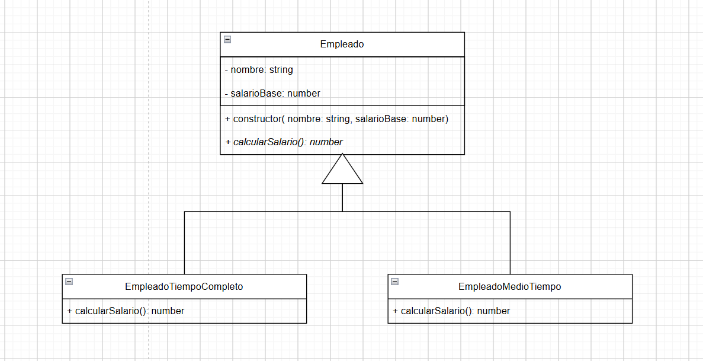
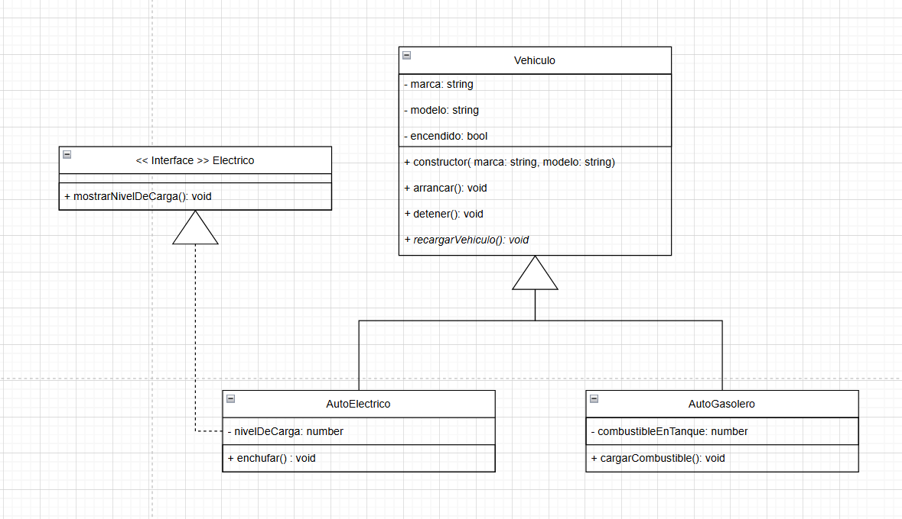

# Programación-IV-Grupo21

**Integrantes**: Atala Jeremias, Natalini Juan Blas, Pizzico Ramiro y Tedechi Gómez Giuliano

## TP1

*Carpetas*
TP1:<br>
├Punto1<br>
├Punto2<br>
├Punto3<br>
├Punto4<br>
└Punto5

En cada carpeta estan los separados como proyectos diferentes, cada una con su package.json, tsconfig, /dist, /src y /node_modules.

comandos para correr los programas:

``` 
cd TP1
cd PuntoX
npm run build
npm run start 
```

Diagramas UML requeridos:

Ejercicio 3:



Ejercicio 5:



## TP2

1. Creamos el test en el cual fuimos trabajando, la clase Order para su utilización y también creamos la interfase de Order para poder crearla. (Estado del test Red)
2. Creamos el MockOrders para poder utilizarlo dentro del test (Estado del test Red)
3. Empezamos a "crear" una orden para poder ver los errores dentro del Mock. (Estado del test Red)
4. Modificamos el Mock para que generase dentro del test el objeto que queríamos crear y funcionó (Estado del test Red)
5. Creamos distintas consultas que fueron creando más errores por falta de código y lo fuimos modificando hasta llegar al punto de que pasen todas las pruebas pedidas (Estado del test Green)

